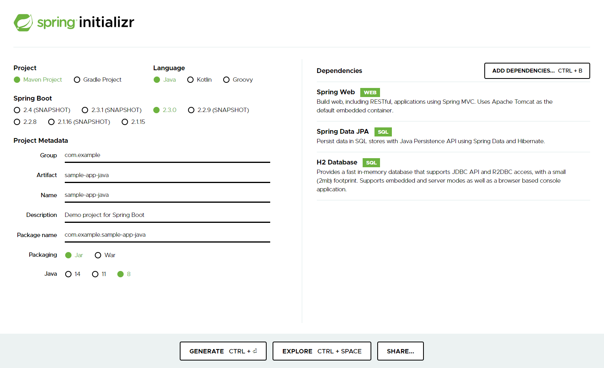
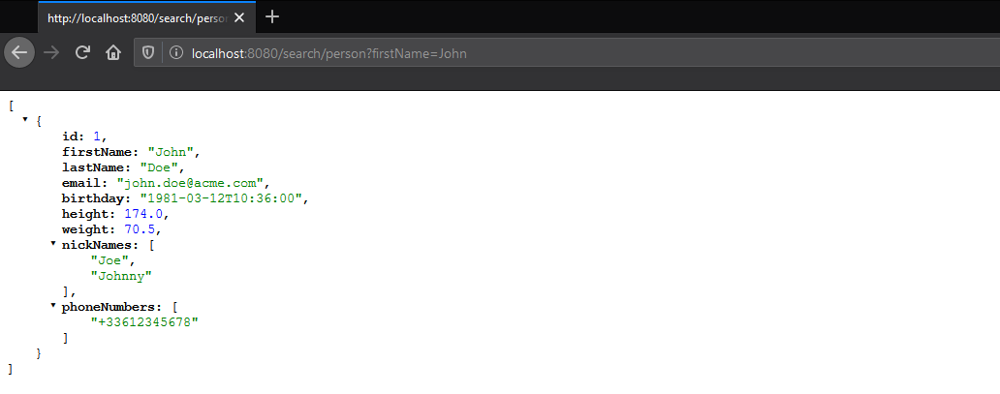

# Spring Data Search
Spring Data Search allows to automatically expose endpoints in order to search for data related to JPA entities.

Spring Data Search provides an advanced search engine that does not require the creation of JPA repositories with custom methods needed to search on different fields of JPA entities.

We can search on any field, combine multiple criteria to refine the search, and even search on deep fields. 

## Why use Spring Data Search?
Spring Data Rest builds on top of the Spring Data repositories and automatically exports those as REST resources. 

However, when we want to search for JPA entities according to different criteria, we need to define several methods in the Repositories to perform different searches.

Moreover, by default REST endpoints return JPA Entities content directly to the client, without mapping with a dedicated DTO class.\
We can use Projections on Repositories, but this means that from the architecture level, we strongly associate the infrastructure layer with the application layer.

Spring Data Search allows to easily expose an endpoint for a JPA entity and thus be able to search on any fields of this entity, to combine several criteria and even search on fields belonging to sub-entities.

Let's say you manage Persons associated with Addresses, Vehicles and a Job.\
You want to allow customers to search for them, regardless of the search criteria:
* Search for Persons whose first name is "John" or "Jane"...
* Search for Persons whose company where they work is "Acme", and own a car, or a motorbike 
* Search for Persons who live in London

You could create a Repository with custom methods to perform all these searches, and you could add new custom methods according to the needs.\
Alternatively, you can use Spring Data Search which allows you to perform all these searches with a minimum configuration, without the need of a custom Repository. If you want to do other different searches, you do not need to add new methods to do that.

## Build
[]()
[]()

[](https://github.com/Kobee1203/spring-data-search/actions?query=workflow%3A%22Build+and+Analyze)
[]()

[](https://sonarcloud.io/dashboard?id=spring-data-search)
[](https://sonarcloud.io/dashboard?id=spring-data-search)
[](https://sonarcloud.io/dashboard?id=spring-data-search)
[](https://sonarcloud.io/dashboard?id=spring-data-search)

### Built with:
* [Kotlin](https://kotlinlang.org/)
* [Spring Boot](https://spring.io/projects/spring-boot)
* [Maven](https://maven.apache.org/)

## Getting Started

### Prerequisites
* JDK 8 or more.
* Spring Boot

### Installation
[]()
[](https://github.com/Kobee1203/spring-data-search/releases)
[]()

* You can download the [latest release](https://github.com/Kobee1203/spring-data-search/releases).
* If you have a [Maven](https://maven.apache.org/) project, you can add the following dependency in your `pom.xml` file:
  ```xml
  <dependency>
      <groupId>com.weedow</groupId>
      <artifactId>spring-data-search</artifactId>
      <version>0.0.1</version>
  </dependency>
  ```
* If you have a [Gradle](https://gradle.org/) project, you can add the following dependency in your `build.gradle` file:
  ```groovy
  implementation "com.weedow:spring-data-search:0.0.1"
  ```

## Usage

### First Example in 5 minutes

* Go to https://start.spring.io/
* Generate a new Java project `sample-app-java` with the following dependencies:
    * Spring Web
    * Spring Data JPA
    * H2 Database
    
* Update the generated project by adding the dependency of Spring Data Search:
    * For [Maven](https://maven.apache.org/) project, add the dependency in the `pom.xml` file: 
    ```xml
    <dependency>
      <groupId>com.weedow</groupId>
      <artifactId>spring-data-search</artifactId>
      <version>0.0.1</version>
    </dependency>
    ```
    * For [Gradle](https://gradle.org/) project, add the dependency in the `build.gradle` file:
    ```groovy
    implementation "com.weedow:spring-data-search:0.0.1"
    ```
* Create a new file `Person.java` to add a new JPA Entity `Person` with the following content:
    ```java
    import javax.persistence.*;
    import java.time.LocalDateTime;
    import java.util.Set;
    
    @Entity
    public class Person {
    
        @Id
        @GeneratedValue
        private Long id;
    
        @Column(nullable = false)
        private String firstName;
    
        @Column(nullable = false)
        private String lastName;
    
        @Column(unique = true, length = 100)
        private String email;
    
        @Column
        private LocalDateTime birthday;
    
        @Column
        private Double height;
    
        @Column
        private Double weight;
    
        @ElementCollection(fetch = FetchType.EAGER)
        private Set<String> nickNames;
    
        @ElementCollection
        @CollectionTable(name = "person_phone_numbers", joinColumns = {@JoinColumn(name = "person_id")})
        @Column(name = "phone_number")
        private Set<String> phoneNumbers;
    
        public Long getId() {
            return id;
        }
    
        public Person setId(Long id) {
            this.id = id;
            return this;
        }
    
        public String getFirstName() {
            return firstName;
        }
    
        public String getLastName() {
            return lastName;
        }
    
        public String getEmail() {
            return email;
        }
    
        public LocalDateTime getBirthday() {
            return birthday;
        }
    
        public Double getHeight() {
            return height;
        }
    
        public Double getWeight() {
            return weight;
        }
    
        public Set<String> getNickNames() {
            return nickNames;
        }
    
        public Person setNickNames(Set<String> nickNames) {
            this.nickNames = nickNames;
            return this;
        }
    
        public Set<String> getPhoneNumbers() {
            return phoneNumbers;
        }
    
        public Person setPhoneNumbers(Set<String> phoneNumbers) {
            this.phoneNumbers = phoneNumbers;
            return this;
        }
    
        public boolean equals(Object object) {
            if (this == object) {
                return true;
            }
            if (object == null || getClass() != object.getClass()) {
                return false;
            }
            if (!super.equals(object)) {
                return false;
            }
    
            Person person = (Person) object;
    
            if (!firstName.equals(person.firstName)) {
                return false;
            }
            if (!lastName.equals(person.lastName)) {
                return false;
            }
    
            return true;
        }
    
        public int hashCode() {
            int result = super.hashCode();
            result = 31 * result + firstName.hashCode();
            result = 31 * result + lastName.hashCode();
            return result;
        }
    }
    ```
* Add the following Configuration class to add a new `SearchDescriptor`:
    ```java
    import com.example.sampleappjava.entity.Person;
    import com.weedow.spring.data.search.config.SearchConfigurer;
    import com.weedow.spring.data.search.descriptor.SearchDescriptor;
    import com.weedow.spring.data.search.descriptor.SearchDescriptorBuilder;
    import com.weedow.spring.data.search.descriptor.SearchDescriptorRegistry;
    import org.springframework.context.annotation.Configuration;
    
    @Configuration
    public class SampleAppJavaConfiguration implements SearchConfigurer {
    
        @Override
        public void addSearchDescriptors(SearchDescriptorRegistry registry) {
            registry.addSearchDescriptor(personSearchDescriptor());
        }
    
        private SearchDescriptor<Person> personSearchDescriptor() {
            return new SearchDescriptorBuilder<Person>(Person.class).build();
        }
    }
    ```
* Create a new file `data.sql` in `/src/main/resources`, and add the following content:
  ```sql
  INSERT INTO PERSON (id, first_name, last_name, email, birthday, height, weight)
      VALUES (1, 'John', 'Doe', 'john.doe@acme.com', '1981-03-12 10:36:00', 174.0, 70.5);
  INSERT INTO PERSON (id, first_name, last_name, email, birthday, height, weight)
      VALUES (2, 'Jane', 'Doe', 'jane.doe@acme.com', '1981-11-26 12:30:00', 165.0, 68.0);
  
  INSERT INTO PERSON_PHONE_NUMBERS (person_id, phone_number) VALUES (1, '+33612345678');
  INSERT INTO PERSON_PHONE_NUMBERS (person_id, phone_number) VALUES (2, '+33687654321');
  
  INSERT INTO PERSON_NICK_NAMES (person_id, nick_names) VALUES (1, 'Johnny');
  INSERT INTO PERSON_NICK_NAMES (person_id, nick_names) VALUES (1, 'Joe');
  ```
* Run the application:
    * For Maven Project: `./mvnw spring-boot:run`
    * For Gradle Project: `./gradlew bootRun`
    * From your IDE: Run the Main Class `com.example.sampleappjava.SampleAppJavaApplication`
* Open your browser and go to the URL `http://localhost:8080/search/person`

* You can filter the results by adding query parameters representing the JPA Entity fields:\
  Here is an example where the results are filtered by the first name:


## Issues
[]()

## Contributing

Contributions are what make the open source community such an amazing place to be learn, inspire, and create. Any contributions you make are **greatly appreciated**.

1. Fork the Project
2. Create your Feature Branch (`git checkout -b feature/AmazingFeature`)
3. Commit your Changes (`git commit -m 'Add some AmazingFeature'`)
4. Push to the Branch (`git push origin feature/AmazingFeature`)
5. Open a Pull Request

## Contact

Nicolas Dos Santos - [@Kobee1203](https://twitter.com/Kobee1203)

Project Link: <https://github.com/Kobee1203/spring-data-search>

## Social Networks
[]()

[]()
[]()
[]()

## License

[](https://github.com/Kobee1203/spring-data-search/blob/master/LICENSE.txt) \
_Copyright (c) 2020 Nicolas Dos Santos and other contributors_